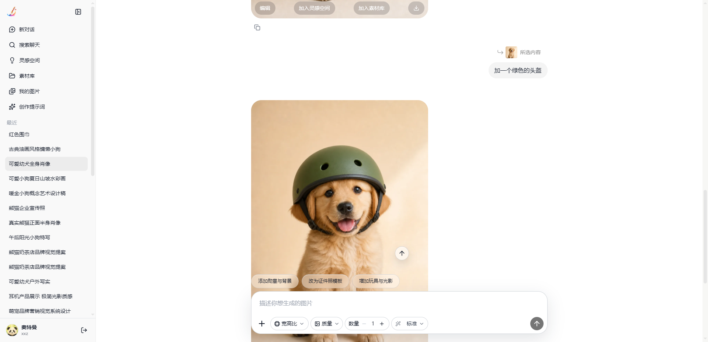
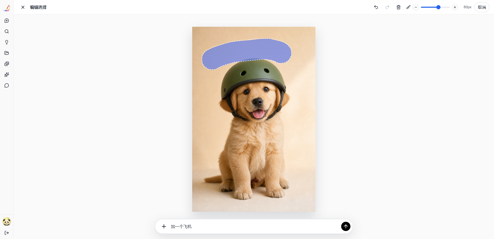
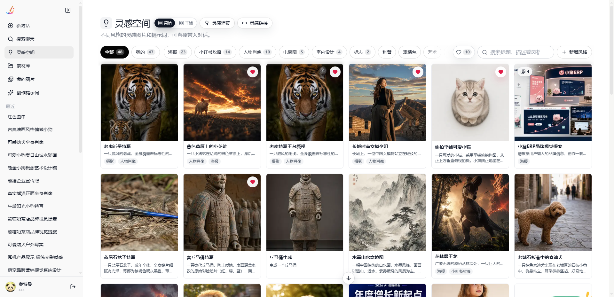
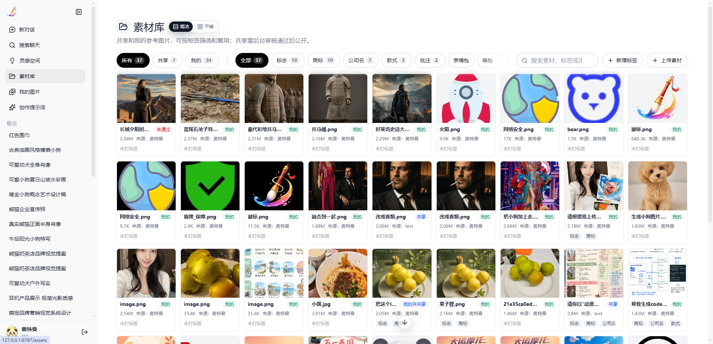
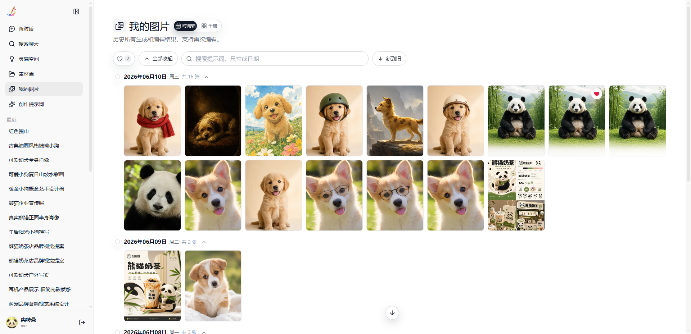
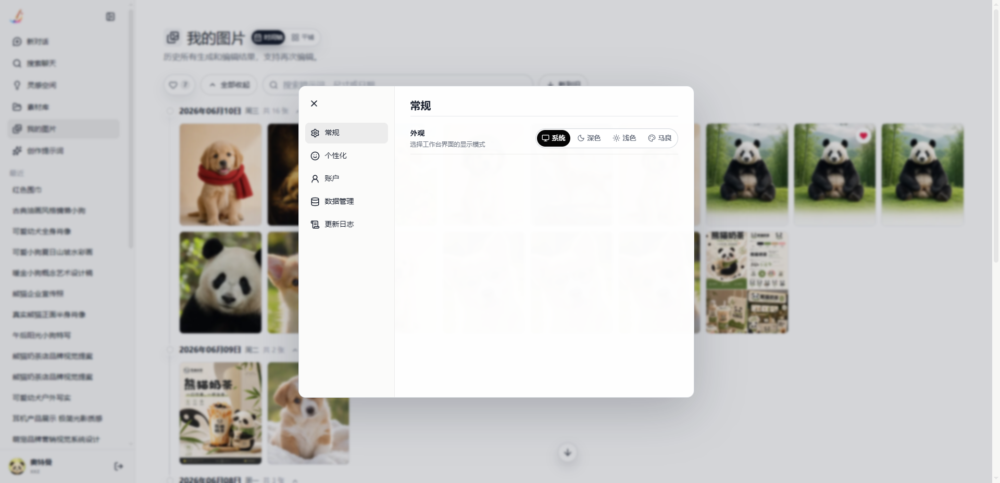
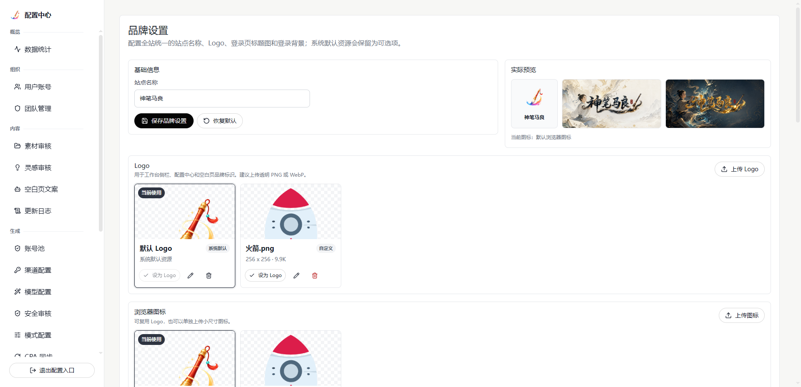

# Shenbi Maliang GPT Image Workbench

[简体中文](README.md) | English

Shenbi Maliang GPT Image Workbench is an AI image generation and image editing workbench designed for private team deployments, primarily for building a team image generation platform powered by ChatGPT `gpt-image-2`.

## ✨ Highlights

- 🖼️ AI image generation and editing workbench for real team workflows.
- 💬 User workspace design and conversational interaction inspired by ChatGPT Web.
- 🧭 Separate user workspace and admin console: users create, admins configure and maintain.
- 🧩 Unified management for image providers, team accounts, assets, cases, and prompt templates.
- 🔌 Supports OpenAI-compatible APIs, CPA proxies, ChatGPT Web routes, and private image endpoints.
- 🔐 Local-first runtime data, suitable for internal team use, private deployment, and customization.

## 🎬 Demo Video

[](https://streamable.com/igquyu)

[Watch the project demo video](https://streamable.com/igquyu)

[Download the project demo video](https://github.com/Xiongdaxz/shenbi-maliang-gpt-image-workbench/releases/download/v0.1.30/demo-video.mp4)

| User generation and editing | Mask-based image editing |
| --- | --- |
|  |  |

| Inspiration gallery | Asset library |
| --- | --- |
|  |  |

| My images | User settings |
| --- | --- |
|  |  |

| Admin branding settings |
| --- |
|  |

## 🚀 Quick Start

```bash
bun install
bun run build
bun run start
```

Open:

- User workspace: http://127.0.0.1:8787
- Admin console: http://127.0.0.1:8787/config
- Health check: http://127.0.0.1:8787/api/health

For development, run backend and frontend dev servers separately:

```bash
bun run dev:api
bun run dev:web
```

## 🧑‍💻 First Use

For first-time setup, the CPA route is recommended because it is simple to configure and works well with account-pool and quota synchronization.

1. Open `http://127.0.0.1:8787/config`.
2. Initialize the admin password.
3. The CPA channel is recommended because it is simple to configure and quick to connect. You can also use an OpenAI-compatible API, ChatGPT Web route, or private image endpoint if needed.
4. If you use a CPA account pool, configure the CPA sync URL and credentials, enable sync, and run one manual sync first so accounts, quotas, and availability are imported.
5. Configure text models in the model settings section. These models power prompt optimization, title generation, daily inspiration copy, safety review, and other assistant-side features. Recommended model: `deepseek-v4-flash`.
6. Create user accounts, or enable registration according to your deployment needs.
7. Return to the user workspace, sign in with a user account, and start generating or editing images.

## 🖌️ User Workspace

The user workspace is for image creation and asset management:

- 💬 Conversational text-to-image generation.
- ✏️ Continue editing from existing images.
- 🖼️ Upload local images as references.
- 🗂️ Choose reference assets from the asset library.
- 🕘 View chat history and generated images.
- ⭐ Favorite, download, preview, and manage generated images.
- 💡 Add selected images to inspiration cases.
- 🧱 Use prompt templates to generate structured prompts.
- 👥 Manage personal and shared assets.

## ⚙️ Admin Console

The admin console is available at `/config` and is for administrators and deployment maintainers:

- 👤 Manage users, teams, and account status.
- 🎛️ Configure image providers, models, sizes, qualities, routing modes, and retry settings.
- 🔀 Manage CPA, ChatGPT Web, API, and other image channels.
- 🧮 Manage account pools, quota refresh, and request logs.
- 📮 Configure proxy, email, SMS, registration, and password reset settings.
- 🧰 Manage inspiration cases, shared asset review, and branding assets.
- 📊 View admin audit logs, image request logs, and model request logs.
- 🕹️ Adjust global switches and selected runtime settings.

## 💾 Runtime Data

The app creates a local `data/` directory:

- `data/app.db`: users, chats, images, assets, cases, and business data.
- `data/config.db`: admin password, providers, secrets, account pools, proxy, email/SMS settings.
- `data/files/`: generated images, uploaded assets, masks, and reference images.

When migrating or backing up the app, back up the entire `data/` directory.

## 🗃️ Project Structure

```text
server/   Backend APIs, image routing, database initialization, file service
src/      User/admin pages, components, state management, API client
public/   Static assets
scripts/  Helper scripts
docs/     Routing, database, and project documentation
data/     Local runtime data directory, created automatically
```

## 📦 Release Packages

Official versions provide the following packages in GitHub Releases:

| Type | Platform / Arch | Package | Format | Startup |
| --- | --- | --- | --- | --- |
| Portable runtime | Windows x64 | `shenbi-maliang-X.Y.Z-windows-x64-portable.zip` | zip + exe | Unzip, open the `shenbi-maliang` directory, and double-click `ShenbiMaliang.exe` |
| Portable runtime | Windows ARM64 | `shenbi-maliang-X.Y.Z-windows-arm64-portable.zip` | zip + exe | For Windows ARM devices. Unzip, open the `shenbi-maliang` directory, and double-click `ShenbiMaliang.exe` |
| Portable runtime | Linux x64 | `shenbi-maliang-X.Y.Z-linux-x64-portable.zip` | zip + executable | Unzip, open the `shenbi-maliang` directory, then run `chmod +x ./shenbi-maliang && ./shenbi-maliang` |
| Portable runtime | Linux ARM64 | `shenbi-maliang-X.Y.Z-linux-arm64-portable.zip` | zip + executable | For ARM64/aarch64 servers, NAS devices, or development boards. Unzip, open the `shenbi-maliang` directory, then run `chmod +x ./shenbi-maliang && ./shenbi-maliang` |
| Portable runtime | macOS Intel | `shenbi-maliang-X.Y.Z-macos-x64-portable.zip` | zip + executable | Unzip, open the `shenbi-maliang` directory, then run `chmod +x ./shenbi-maliang && ./shenbi-maliang` |
| Portable runtime | macOS Apple Silicon | `shenbi-maliang-X.Y.Z-macos-arm64-portable.zip` | zip + executable | Unzip, open the `shenbi-maliang` directory, then run `chmod +x ./shenbi-maliang && ./shenbi-maliang` |
| Source run package | Windows / Linux / macOS | `shenbi-maliang-X.Y.Z-source-run.zip` | zip + source | Run `start-update.bat` on Windows, or `bash ./start.sh` on Linux/macOS |

`shenbi-maliang-X.Y.Z-source-run.zip` does not include an executable, `node_modules`, or build output. You can also run `bun install --frozen-lockfile`, `bun run build`, and `bun run start` manually. GitHub Releases also provide the raw `Source code (zip)` and `Source code (tar.gz)` automatically. Use `git clone` if you want the full repository history. Runtime data is created in `data/`. Back up `data/` before upgrading.

## 🙏 Acknowledgements

The user workspace design and conversational interaction are inspired by ChatGPT Web.

This project references the following open-source projects for ChatGPT Web image routing, CPA/Responses routing, and API compatibility design:

- [chatgpt2api](https://github.com/basketikun/chatgpt2api)
- [CLIProxyAPI](https://github.com/router-for-me/CLIProxyAPI)

## ⚠️ Disclaimer

This project is intended for learning, research, technical exchange, internal technical validation, private deployment, and customization reference. It does not provide any official model service, account quota, API key, or commercial service commitment.

- This project is not an official project of OpenAI, ChatGPT, or any related service provider, and is not endorsed by them.
- Users are responsible for complying with applicable laws and regulations, as well as the terms of service, usage policies, and content policies of OpenAI, ChatGPT, model providers, proxy services, and third-party APIs.
- Do not use this project for unauthorized commercial services, illegal content generation, infringement of others' rights, access-control bypassing, bulk API abuse, or any use that violates applicable service terms.
- Using accounts, cookies, proxies, reverse-engineered routes, or automated requests may trigger third-party risk controls, verification challenges, rate limits, quota deductions, temporary restrictions, account suspension, or service termination. Use only accounts and APIs you are authorized to use, and avoid testing with important primary accounts or production accounts.
- Users are responsible for managing API keys, cookies, account credentials, proxy settings, and runtime data. Any consequences related to credential leakage, account risk, API costs, generated content, or data compliance are the user's responsibility.
- AI-generated content may be inaccurate, inappropriate, infringing, or otherwise unexpected. Before using generated content in public, production, or commercial scenarios, users should perform manual review, copyright checks, and compliance assessment.
- This disclaimer is not legal advice. For commercial or production use, consult qualified legal or compliance professionals based on your actual use case.
- This project is provided as is, without any guarantee of stability, availability, fitness, or output accuracy. Any deployment, modification, integration, or use is at the user's own discretion and risk.

## 📄 License

MIT. See [LICENSE](LICENSE).

## 🤝 Community Support

- [LINUX DO](https://linux.do/) community
