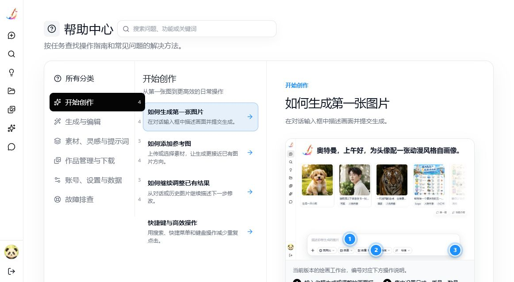

# 帮助中心

## 定位

帮助中心面向工作台使用者，按“要完成的任务”组织操作指南和问题排查。它是前端静态、随版本发布的内容，不包含在线客服、工单、评论或后台编辑能力。

入口位于侧栏底部的用户卡片中，在“退出登录”下方；页面路由为 /help。

## 内容结构

帮助中心的内容注册表位于 src/lib/helpCenter.ts：

- HelpCategory：分类 ID、图标、标题和摘要。
- HelpArticle：文章 ID、分类、标题、摘要、搜索关键词、Markdown 正文、可选产品内跳转和可选操作截图。
- HelpArticleVisual：截图路径、替代文本、说明文字，以及按百分比定位的编号标记。
- HELP_POPULAR_ARTICLE_IDS：首页展示的常用问题。

所有面向用户的文本均使用 help.* i18n key：

- 简体中文：src/i18n/messages/zh-CN.ts
- 英文：src/i18n/messages/en-US.ts
- 日语、韩语、西班牙语、法语、德语、巴西葡萄牙语、俄语和波斯语：src/i18n/messages/helpCenterOverrides.ts

繁体中文沿用现有的简体中文转换。其他已启用语言均完整覆盖 help.* 文案，不再回退英文。

## 页面预览

下图由当前版本的内置浏览器页面实际截取，用于校验三栏布局、截图标记和图例在文章中的显示效果。

## 品牌视觉

- 页面标题使用现有马良画笔 Logo。
- 首页横幅使用 `public/image/help/maliang-help-hero-v2.webp`，以小马良角色为参考重新生成“桌边解答”场景，并按帮助中心的超宽卡片比例重新排版，确保人物完整、左侧留白稳定。
- 分类卡片使用同一画笔 Logo 作为低对比度水印，并按任务类型配置轻量色彩渐变。
- 品牌图片均为装饰内容，使用空替代文本，不影响读屏器读取帮助标题和分类名称。

## URL 约定

- /help：帮助中心首页。
- /help?category=<id>：指定分类的问题列表。
- /help?category=<id>&article=<id>：直接打开指定文章。
- /help?q=<keyword>：跨全部分类搜索；搜索结果仍可打开并分享文章链接。

页面会安全忽略无效的分类或文章 ID，并回落到可用的帮助视图。

## 新增或修改文章

1. 在 HELP_ARTICLES 增加文章定义，使用稳定、可读的英文 ID。
2. 文章必须归入现有分类；新分类同时补充图标映射、各语言标题和摘要。
3. 在中英文消息文件新增 title、summary、keywords、body 文案，并在 helpCenterOverrides.ts 为其他八种语言补齐相同键。
4. 正文使用现有 MarkdownView 支持的 Markdown：标题、段落、列表、强调、行内代码和 HTTPS 链接。
5. 只写入已在产品中存在且可验证的行为；如果给出产品内跳转，确认目标路由或设置入口真实可用。
6. 需要截图时，使用当前版本的真实页面截图，放在 public/image/help/；优先截取能看清操作区域的视口，不使用旧版演示图。
7. 为截图配置 altKey、captionKey 和 markers；标记坐标使用图片宽高百分比，并为每个标记提供所有已启用语言的说明。
8. 运行 bun run check 与 bun run build。

## 写作规则

- 标题使用用户会直接搜索的问题句式，例如“如何下载压缩包”或“生成失败怎么办”。
- 正文优先包含“操作步骤”和“注意事项”；故障文章先写检查项，再写安全的重试建议。
- 不记录隐藏功能、开发配置、渠道密钥或绕过限制的方法。
- 仅在用户可直接执行相应动作时提供“前往操作”按钮。
